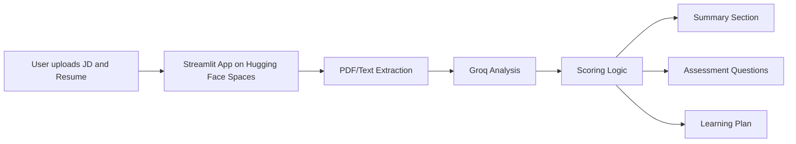

# JD Skill Analyzer

JD Skill Analyzer is a Streamlit-based AI application deployed on **Hugging Face Spaces**. It analyzes a job description and a resume, identifies skill gaps, evaluates personality and work-style fit, generates interview-style assessment questions, and creates a personalized learning plan.

## Live Demo
- [https://huggingface.co/spaces/Angelandy/JD-Skill-Analyzer](https://huggingface.co/spaces/Angelandy/JD-Skill-Analyzer)

## What this project helps with
This project helps compare a **job description** with a **resume** to see how well a candidate fits a role.

It helps to:
- Identify **hard skills** the candidate has or is missing, such as Python, SQL, data analysis, or dashboarding.
- Identify **soft skills** or personality-related traits, such as communication, teamwork, and adaptability.
- Estimate **overall fit** for the role.
- Explain in simple text **why the candidate is a good fit or not**.
- Generate **assessment questions** for missing skills.
- Create a **personalized learning plan** to close skill gaps.
- Support hiring or career development decisions by making JD and resume analysis faster and clearer.

In short, it is a tool for **candidate-job matching, skill-gap analysis, and personalized improvement guidance**.

## What the app does
- Upload or paste a job description and a resume.
- Extract text from PDF files.
- Analyze the job description using Groq.
- Detect hard skills and soft skills separately.
- Calculate overall fit, ability fit, and personality fit.
- Generate a clear paragraph summary of missing skills and organizational fit.
- Generate assessment questions.
- Build a personalized learning plan.

## Why hard skills and soft skills both matter
- **Hard skills** are technical, measurable abilities such as Python, SQL, data analysis, or dashboarding.
- **Soft skills** are behavioral and interpersonal qualities such as teamwork, communication, adaptability, and collaboration.
- Hard skills show whether the candidate can do the work.
- Soft skills show whether the candidate can work well in the team and company culture.
- Including both gives a more realistic evaluation of the candidate’s overall fit.

## Why organization and sector context matters
- The organization name and sector help the model understand the company’s environment and business goals.
- Sector context improves interpretation of required skills, for example a startup may value speed and flexibility more than a large enterprise.
- Organization context also helps infer culture signals and work style from the JD.
- This makes the summary and learning plan more relevant and personalized.

## Deployment
This project is deployed on Hugging Face Spaces using Streamlit. The GitHub repository uses `app.py` as the main file, and the Hugging Face Space runs the same codebase from its own configured app file path. The app reads the `GROQ_API_KEY` secret from Hugging Face, extracts text from the uploaded JD and resume, sends the content to the Groq model for analysis, and then displays the score, summary, questions, and learning plan in the web app.

## How scoring works
- Ability skills are matched against resume skills and tools.
- Personality skills are matched against strengths and behavioral signals.
- Overall fit is calculated as:
  - 70% ability score
  - 30% personality score

## Tech stack
- Streamlit
- Python
- Groq API
- pypdf
- Hugging Face Spaces

## Local setup
1. Clone the repository:
   ```bash
   git clone https://github.com/angelandy1909/JD-Skill-Analyzer.git
   cd JD-Skill-Analyzer
   ```
2. Install dependencies:
   ```bash
   pip install -r requirements.txt
   ```
3. Add environment variables:
   - `GROQ_API_KEY`
   - `GROQ_MODEL=llama-3.3-70b-versatile`
4. Run the app:
   ```bash
   streamlit run app.py
   ```

## Sample input
### Job Description
A role requiring Python, SQL, dashboards, stakeholder communication, teamwork, and adaptability.

### Resume
A candidate with Python, pandas, SQL, reporting, and team project experience.

## Sample output
- Overall fit score
- Ability fit score
- Personality fit score
- Summary paragraph
- Missing skills
- Assessment questions
- Personalized learning plan

## Architecture


## Demo video
- Add your 3–5 minute demo video link here.

## Notes
- This project is deployed on Hugging Face Spaces using Streamlit.
- The app file in this repository is `app.py`.
- The same codebase is used for the Hugging Face deployment under the file 'src/streamlit.app.py'.
- The Hugging Face Space is configured to run the correct app file from its own repository structure.
- Both deployments use the same codebase and logic.
- The public repo contains the source code and README for submission.
