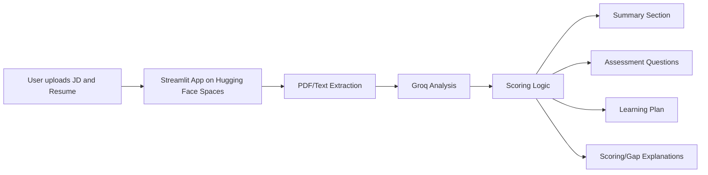

# JD Skill Analyzer

JD Skill Analyzer is a Streamlit-based AI application deployed on **Hugging Face Spaces**. It analyzes a job description and a resume, identifies skill gaps, evaluates personality and work-style fit, generates interview-style assessment questions, and creates a personalized learning plan focused on adjacent skills the candidate can realistically acquire.

## Live Demo
- [[https://huggingface.co/spaces/Angelandy/JD-Skill-Analyzer](https://huggingface.co/spaces/Angelandy/JD-Skill-Analyzer)]

## Project Purpose
JD Skill Analyzer compares a job description with a resume to evaluate candidate fit. It identifies skill gaps, keyword gaps and role alignment issues, then suggests resume edits and personalized learning recommendations. This helps candidates highlight the right experience and build missing skills through a personalized learning plan focused on adjacent skills, with suggested platforms that provide easy access to the right resources. It also generates assessment questions based on weak or missing skills, helping candidates prepare for interviews while enabling recruiters to quickly see strong matches, gaps, and areas needing further evaluation. The tool acts as a bridge between job openings and resumes, improving both candidate preparation and hiring efficiency.


It helps to:
- Identify **hard skills** the candidate has or is missing, such as Python, SQL, data analysis, dashboarding, or generative AI.
- Identify **soft skills** or personality-related traits, such as communication, teamwork, adaptability, and collaboration.
- Estimate **overall fit** for the role.
- Explain in simple text **why the candidate is a good fit or not**.
- Explain **how the score is calculated** using ability and personality weights.
- Show a **detailed role-analysis reason** based on signals found in the job description.
- Generate **assessment questions** based on missing or weakly supported skills.
- Create a **personalized learning plan** with estimated time, curated resources, and free/paid course suggestions.
- Support hiring or career development decisions by making JD and resume analysis faster and clearer.
- Resume editing help: improves how the candidate presents current skills.
- Learning plan: helps the candidate build missing skills for future roles.

In short, it is a tool for **candidate-job matching, skill-gap analysis, and personalized improvement guidance**.

## What the app does
- Upload or paste a job description and a resume.
- Extract text from PDF files.
- Analyze the job description using Groq.
- Detect hard skills and soft skills separately.
- Calculate overall fit, ability fit, and personality fit.
- Generate a clear paragraph summary of candidate fit.
- Add detailed explanations for scoring, job description understanding, resume profiling, and skill-gap reasoning.
- Generate assessment questions.
- Build a personalized learning plan.
- Recommend learning resources with **free** and **paid** labels.

## Why Both Skill Types Matter
- **Hard skills** are technical, measurable abilities such as Python, SQL, data analysis, dashboards, or Gen AI.
- **Soft skills** are behavioral and interpersonal qualities such as teamwork, communication, adaptability, and collaboration.
- Hard skills show whether the candidate can do the work.
- Soft skills show whether the candidate can work well in the team and company culture.
- Including both gives a more realistic evaluation of the candidate’s overall fit.

## Understanding Organization and Sector Relevance
- The organization name and sector help the model understand the company’s environment and business goals.
- Sector context improves interpretation of required skills, for example a startup may value speed and flexibility more than a large enterprise.
- Organization context also helps infer culture signals and work style from the JD.
- This makes the summary and learning plan more relevant and personalized.

## Scoring logic
- Ability skills are matched against resume skills, tools, strengths, and domain evidence.
- Personality skills are matched against resume strengths and behavioral signals.
- The app now explains the score calculation in text.
- The role analysis also explains why the role is treated as ability-heavy, personality-heavy, or balanced.
- In the current logic, the final score is calculated using role-specific weights across ability and personality fit.

## Learning plan
The learning plan is now more personalized and practical.

It:
- Focuses on **adjacent skills** the candidate can realistically acquire next.
- Includes **estimated time** for each priority skill.
- Suggests **curated resources** for each missing skill.
- Labels courses and resources as **free** or **paid**.
- Can recommend examples like **Kaggle’s free Gen AI training** for Gen AI-related gaps.
- Gives a **detailed strategy** section that explains what to learn first and why.

## Assessment questions
The assessment questions are now generated based on the skills that are missing or weakly supported in the resume.

They are designed to:
- Focus on high-impact ability gaps first.
- Include the most relevant personality gaps.
- Ask practical interview-style questions.
- Show what a strong answer should include.

## Skill-gap reasoning
The app now explains how skill gaps are identified.

It compares:
- The skills and evidence mentioned in the **job description**, and
- The skills, tools, strengths, and behavioral signals in the **resume**.

A skill gap is shown when the JD asks for a capability or behavior and the resume does not provide a matching signal or close equivalent. This makes the comparison easier to understand and more transparent.

## Deployment
This project is deployed on Hugging Face Spaces using Streamlit. The GitHub repository uses `app.py` as the main file, and the Hugging Face Space runs the same codebase from its configured app file path. The app reads the `GROQ_API_KEY` secret from Hugging Face, extracts text from the uploaded JD and resume, sends the content to the Groq model for analysis, and then displays the score, summary, explanations, questions, and learning plan in the web app.

## Tech stack
- Streamlit
- Python
- Groq API
- pypdf
- Hugging Face Spaces
- Pydantic

## Local setup
1. Clone the repository:
   ```bash
   git clone https://github.com/angelandy1909/JD-Skill-Analyzer.git
   cd JD-Skill-Analyzer
   ```
2. Install dependencies:
   ```bash
   pip install -r requirements.txt
   ```
3. Add environment variables:
   - `GROQ_API_KEY`
   - `GROQ_MODEL=llama-3.3-70b-versatile`
4. Run the app:
   ```bash
   streamlit run app.py
   ```

## Sample input
## Job Description
A role requiring Python, SQL, dashboards, stakeholder communication, teamwork, adaptability, and Gen AI familiarity.

## Resume
A candidate with Python, pandas, SQL, reporting, and team project experience.

## Sample output
- Overall fit score
- Ability fit score
- Personality fit score
- Summary paragraph
- Score explanation paragraph
- Job description explanation paragraph
- Resume profile explanation paragraph
- Skill gap explanation paragraph
- Assessment questions
- Personalized learning plan
- Free/paid course suggestions

## Architecture


The diagram shows a simple end-to-end workflow for the app. The user first uploads a job description and resume into the Streamlit interface, the app extracts text from the files, sends that text to Groq for analysis, and then applies scoring logic to generate the final outputs. After analysis, the app produces the summary section, assessment questions, learning plan, and scoring/gap explanations. This structure helps users understand not only the fit score, but also why the score was given and what the candidate should improve next.


## How Scoring Works

The scoring is role-specific and changes based on whether the job is more ability-heavy, personality-heavy, or balanced. The app compares the resume against the job description, gives separate ability and personality scores, and then combines them using weights based on the role type so technical roles emphasize ability more while people-focused roles emphasize personality more.

---
## Sample Inputs

Sample Job Description – Medical Sector
**Role:** Emergency Medical Technician (EMT)  
**Sector:** Healthcare / Emergency Services  
**Location:** Chennai, India  
**Type:** Full-time  

We are seeking a dedicated Emergency Medical Technician (EMT) to join our hospital’s emergency response team. The role requires strong clinical knowledge, quick decision-making skills, and the ability to provide immediate care to patients in critical situations. You will work closely with doctors, nurses, and paramedics to stabilize patients and ensure safe transport to medical facilities.

Responsibilities
- Respond to emergency calls and provide immediate medical care on-site.  
- Assess patient condition and administer first aid, CPR, or advanced life support as required.  
- Safely transport patients to hospitals while monitoring vital signs.  
- Collaborate with doctors and nurses to hand over patient information accurately.  
- Maintain medical equipment and ensure readiness of emergency kits.  
- Document patient care and prepare incident reports.  

Required Skills
- Knowledge of emergency medical procedures  
- CPR and first aid certification  
- Ability to operate medical equipment (defibrillators, oxygen tanks, stretchers)  
- Strong communication and teamwork skills  
- Physical stamina and ability to work under pressure  
- Attention to detail and adaptability  

Preferred Skills
- Advanced life support certification  
- Experience in hospital or ambulance services  
- Familiarity with electronic health records (EHR) systems  
- Problem solving in high-stress environments  

Resume – Emergency Medical Technician

**Name:** Arjun Menon  
**Location:** Chennai, India  

Summary
Compassionate and quick-thinking Emergency Medical Technician with hands-on experience in patient care during emergencies. Skilled in CPR, first aid, and safe patient transport. Dedicated to ensuring patient safety and collaborating effectively with healthcare teams.

Skills
- CPR and First Aid  
- Patient assessment  
- Medical equipment handling  
- Communication  
- Team collaboration  
- Problem solving  

Experience
**EMT Intern | Chennai General Hospital**  
- Responded to emergency calls and assisted in stabilizing patients.  
- Administered CPR and first aid under supervision of senior paramedics.  
- Assisted in transporting patients safely to hospital facilities.  
- Documented patient information and prepared incident reports.  

Projects
- Organized a community CPR training workshop.  
- Assisted in setting up emergency medical kits for hospital ambulances.  

Education
- Diploma in Emergency Medical Technology  
- Certified in CPR and Basic Life Support (BLS)

---

## Demo video
[- Add your 3–5 minute demo video link here.](https://drive.google.com/drive/folders/1x6Ri6mAlIP5WXTvCspLPhwuh_bKpB4bN?usp=drive_link)

## Notes
- This project is deployed on Hugging Face Spaces using Streamlit.
- The app file in this repository is `app.py`.
- The same codebase is used for the Hugging Face deployment.
- The app includes detailed explanations for scoring, skill gaps, and role analysis.
- The learning plan includes curated free and paid courses for missing skills.
- Groq JSON mode is used to ensure valid JSON outputs for structured sections.
