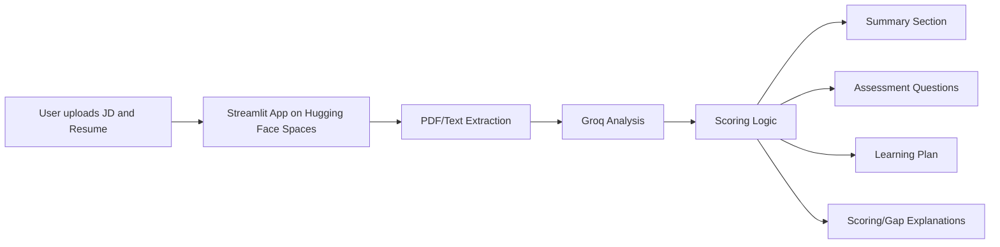
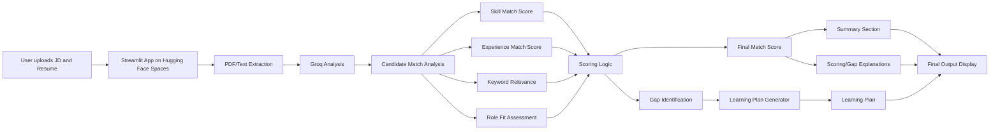

# JD Skill Analyzer

JD Skill Analyzer is a Streamlit-based AI application deployed on **Hugging Face Spaces**. It analyzes a job description and a resume, identifies skill gaps, evaluates personality and work-style fit, generates interview-style assessment questions, and creates a personalized learning plan focused on adjacent skills the candidate can realistically acquire.

## Live Demo
- [[https://huggingface.co/spaces/Angelandy/JD-Skill-Analyzer](https://huggingface.co/spaces/Angelandy/JD-Skill-Analyzer)]

## Project Purpose
This project helps compare a **job description** with a **resume** to see how well a candidate fits a role. The model analyzes the candidate’s resume against a company-specific job description and identifies skill gaps, keyword gaps, and role alignment issues. Based on this analysis, it suggests resume edits and learning recommendations to improve the candidate’s match with the target role. It helps candidates understand what is missing in their resume for a specific company or role. They can then improve their resume wording, highlight the right experience, and focus on the skills they need to build. It helps recruiters and hiring teams shortlist candidates faster. Instead of manually reading every resume in detail, they can quickly see who is a strong match, who has gaps, and who may need further evaluation. This saves time and improves hiring quality. The model acts like a bridge between a job opening and a candidate’s resume. It tells the candidate how to improve and tells the company who fits best.

It helps to:
- Identify **hard skills** the candidate has or is missing, such as Python, SQL, data analysis, dashboarding, or generative AI.
- Identify **soft skills** or personality-related traits, such as communication, teamwork, adaptability, and collaboration.
- Estimate **overall fit** for the role.
- Explain in simple text **why the candidate is a good fit or not**.
- Explain **how the score is calculated** using ability and personality weights.
- Show a **detailed role-analysis reason** based on signals found in the job description.
- Generate **assessment questions** based on missing or weakly supported skills.
- Create a **personalized learning plan** with estimated time, curated resources, and free/paid course suggestions.
- Support hiring or career development decisions by making JD and resume analysis faster and clearer.
- Resume editing help: improves how the candidate presents current skills.
- Learning plan: helps the candidate build missing skills for future roles.

In short, it is a tool for **candidate-job matching, skill-gap analysis, and personalized improvement guidance**.

## What the app does
- Upload or paste a job description and a resume.
- Extract text from PDF files.
- Analyze the job description using Groq.
- Detect hard skills and soft skills separately.
- Calculate overall fit, ability fit, and personality fit.
- Generate a clear paragraph summary of candidate fit.
- Add detailed explanations for scoring, job description understanding, resume profiling, and skill-gap reasoning.
- Generate assessment questions.
- Build a personalized learning plan.
- Recommend learning resources with **free** and **paid** labels.

## Why hard skills and soft skills both matter
- **Hard skills** are technical, measurable abilities such as Python, SQL, data analysis, dashboards, or Gen AI.
- **Soft skills** are behavioral and interpersonal qualities such as teamwork, communication, adaptability, and collaboration.
- Hard skills show whether the candidate can do the work.
- Soft skills show whether the candidate can work well in the team and company culture.
- Including both gives a more realistic evaluation of the candidate’s overall fit.

## Why organization and sector context matters
- The organization name and sector help the model understand the company’s environment and business goals.
- Sector context improves interpretation of required skills, for example a startup may value speed and flexibility more than a large enterprise.
- Organization context also helps infer culture signals and work style from the JD.
- This makes the summary and learning plan more relevant and personalized.

## Scoring logic
- Ability skills are matched against resume skills, tools, strengths, and domain evidence.
- Personality skills are matched against resume strengths and behavioral signals.
- The app now explains the score calculation in text.
- The role analysis also explains why the role is treated as ability-heavy, personality-heavy, or balanced.
- In the current logic, the final score is calculated using role-specific weights across ability and personality fit.

## Learning plan
The learning plan is now more personalized and practical.

It:
- Focuses on **adjacent skills** the candidate can realistically acquire next.
- Includes **estimated time** for each priority skill.
- Suggests **curated resources** for each missing skill.
- Labels courses and resources as **free** or **paid**.
- Can recommend examples like **Kaggle’s free Gen AI training** for Gen AI-related gaps.
- Gives a **detailed strategy** section that explains what to learn first and why.

## Assessment questions
The assessment questions are now generated based on the skills that are missing or weakly supported in the resume.

They are designed to:
- Focus on high-impact ability gaps first.
- Include the most relevant personality gaps.
- Ask practical interview-style questions.
- Show what a strong answer should include.

## Skill-gap reasoning
The app now explains how skill gaps are identified.

It compares:
- The skills and evidence mentioned in the **job description**, and
- The skills, tools, strengths, and behavioral signals in the **resume**.

A skill gap is shown when the JD asks for a capability or behavior and the resume does not provide a matching signal or close equivalent. This makes the comparison easier to understand and more transparent.

## Deployment
This project is deployed on Hugging Face Spaces using Streamlit. The GitHub repository uses `app.py` as the main file, and the Hugging Face Space runs the same codebase from its configured app file path. The app reads the `GROQ_API_KEY` secret from Hugging Face, extracts text from the uploaded JD and resume, sends the content to the Groq model for analysis, and then displays the score, summary, explanations, questions, and learning plan in the web app.

## Tech stack
- Streamlit
- Python
- Groq API
- pypdf
- Hugging Face Spaces
- Pydantic

## Local setup
1. Clone the repository:
   ```bash
   git clone https://github.com/angelandy1909/JD-Skill-Analyzer.git
   cd JD-Skill-Analyzer
   ```
2. Install dependencies:
   ```bash
   pip install -r requirements.txt
   ```
3. Add environment variables:
   - `GROQ_API_KEY`
   - `GROQ_MODEL=llama-3.3-70b-versatile`
4. Run the app:
   ```bash
   streamlit run app.py
   ```

## Sample input
## Job Description
A role requiring Python, SQL, dashboards, stakeholder communication, teamwork, adaptability, and Gen AI familiarity.

## Resume
A candidate with Python, pandas, SQL, reporting, and team project experience.

## Sample output
- Overall fit score
- Ability fit score
- Personality fit score
- Summary paragraph
- Score explanation paragraph
- Job description explanation paragraph
- Resume profile explanation paragraph
- Skill gap explanation paragraph
- Assessment questions
- Personalized learning plan
- Free/paid course suggestions

## Architecture


The diagram shows a simple end-to-end workflow for the app. The user first uploads a job description and resume into the Streamlit interface, the app extracts text from the files, sends that text to Groq for analysis, and then applies scoring logic to generate the final outputs. After analysis, the app produces the summary section, assessment questions, learning plan, and scoring/gap explanations. This structure helps users understand not only the fit score, but also why the score was given and what the candidate should improve next.

## Detailed Architecture



The architecture begins when the user uploads a job description and resume into the Streamlit application hosted on Hugging Face Spaces. The app extracts text from the uploaded PDF or text files and sends the content to Groq for analysis.

Candidate match analysis
The Groq analysis compares the resume with the job description to identify matched skills, missing skills, experience alignment, keyword relevance, and overall role fit. These analysis results are then passed into the scoring logic for evaluation.

Scoring logic
The scoring logic calculates the final match score by combining the analyzed signals such as skill match, experience match, keyword relevance, and role fit. This stage focuses on determining how well the candidate fits the job requirements.

Skill-gap reasoning
The skill-gap reasoning stage explains why the candidate received a particular score. It identifies missing skills, weak areas, and improvement points by comparing the resume directly with the job description.

Learning plan generation
The learning plan is created from the identified gaps. It includes suggested topics, recommended practice, and an improvement roadmap to help the candidate close the skill gaps.

Final output
The final output is displayed in the Streamlit interface and includes the summary section, scoring or gap explanations, assessment questions, and the learning plan. This makes the architecture easy to understand because it clearly separates analysis, scoring, gap reasoning, and improvement guidance.

## How Scoring Works

The scoring is role-specific and changes based on whether the job is more ability-heavy, personality-heavy, or balanced. The app compares the resume against the job description, gives separate ability and personality scores, and then combines them using weights based on the role type so technical roles emphasize ability more while people-focused roles emphasize personality more.

## Input Samples that can be used as examples to run the application

Sample - 1 
Job Description – Medical Sector

**Role:** Junior Python Data Analyst  
**Sector:** Healthcare / Medical Research  
**Location:** Chennai, India  
**Type:** Full-time  

We are seeking a Junior Python Data Analyst to support clinical data management, reporting, and visualization for a growing healthcare analytics team. The role requires strong Python and SQL skills, familiarity with medical datasets, and the ability to collaborate with doctors, researchers, and operations teams.

Responsibilities
- Clean, transform, and analyze patient and clinical trial data using Python and SQL.
- Build dashboards and reports to support medical researchers and hospital administrators.
- Work with clinical and operations teams to understand reporting needs.
- Document workflows to ensure reproducibility and compliance with healthcare standards.
- Identify trends, anomalies, and risk factors in medical datasets.
- Present findings clearly to both technical and non-technical healthcare stakeholders.

Required Skills
- Python  
- SQL  
- Data analysis  
- Dashboarding  
- Excel or spreadsheets  
- Communication  
- Teamwork  
- Attention to detail  
- Adaptability  

Preferred Skills
- Power BI or Tableau  
- Experience with healthcare/clinical data  
- Knowledge of HIPAA or medical data compliance  
- Problem solving  

Resume 

**Name:** Drishti Menon  
**Location:** Chennai, India  

Summary
Analytical and detail-oriented data professional with experience in Python, SQL, and healthcare reporting. Skilled at transforming medical datasets into actionable insights and collaborating with cross-functional teams in clinical environments.

Skills
- Python (Pandas, NumPy)  
- SQL  
- Excel  
- Power BI  
- Data visualization  
- Reporting  
- Communication  
- Team collaboration  
- Problem solving  

Experience
**Data Analyst Intern | MedTech Analytics**  
- Cleaned and transformed patient records and trial data using Python and SQL.  
- Built weekly dashboards for hospital administrators and research teams.  
- Collaborated with doctors and operations staff to clarify reporting requirements.  
- Presented findings to non-technical healthcare stakeholders.  

Projects
- Developed a Power BI dashboard to track patient recovery metrics.  
- Automated cleaning of CSV-based clinical trial data using Python scripts.  
- Created a reporting workflow for recurring hospital performance metrics.  

Education
- Bachelor of Science in Computer Science with specialization in Healthcare Informatics

---
Sample - 2

Job Description – Startup Tech Company 

**Role:** Junior Python Data Analyst  
**Sector:** Technology / SaaS Startup  
**Location:** Chennai, India  
**Type:** Full-time  

We are seeking a Junior Python Data Analyst to support product analytics and growth initiatives in our fast-moving startup. The role requires strong Python and SQL skills, familiarity with cloud environments, API integration, and the ability to collaborate with product and engineering teams.

Responsibilities
- Clean, transform, and analyze product usage and customer data using Python and SQL.
- Support product teams with ad-hoc analysis and reporting.
- Collaborate with engineers to integrate data pipelines and APIs.
- Document workflows and ensure reproducibility of analysis.
- Identify trends and opportunities for product optimization.
- Present findings clearly to both technical and non-technical stakeholders.

Required Skills
- Python  
- SQL  
- Data analysis  
- Cloud platforms (AWS, GCP, Azure)  
- API integration  
- Communication  
- Teamwork  
- Attention to detail  
- Adaptability  

Preferred Skills
- Experience with SaaS or startup environments  
- Problem solving  
- Exposure to product analytics tools (Mixpanel, Amplitude)  

Resume

**Name:** Neha Varma  
**Location:** Chennai, India  

Summary
Recent graduate with basic exposure to Python and spreadsheets. Enthusiastic about learning data analysis but limited experience with SQL, cloud platforms, and API integration. Looking to grow into a data analyst role in a startup environment.

Skills
- Python (basic scripting)  
- Excel  
- Communication  
- Team collaboration  
- Problem solving  

Experience
**Intern | Local Business Operations**  
- Entered and organized sales data in Excel.  
- Assisted with basic reporting tasks.  
- Supported operations team with manual data entry.  

Projects
- Created a simple Excel chart for monthly sales.  
- Wrote a basic Python script to calculate averages.  

Education
- Bachelor of Science in Information Technology

---
# Sample - 3 

# pdf formated 


## Demo video
- Add your 3–5 minute demo video link here.

## Notes
- This project is deployed on Hugging Face Spaces using Streamlit.
- The app file in this repository is `app.py`.
- The same codebase is used for the Hugging Face deployment.
- The app includes detailed explanations for scoring, skill gaps, and role analysis.
- The learning plan includes curated free and paid courses for missing skills.
- Groq JSON mode is used to ensure valid JSON outputs for structured sections.
